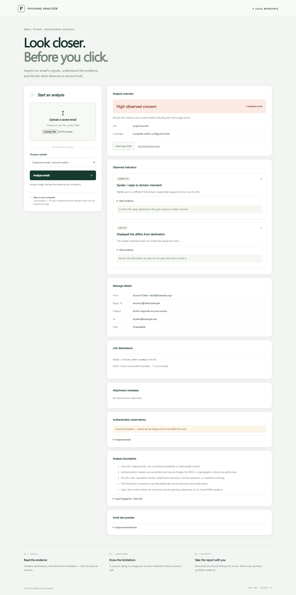

# Phishing Email Analyzer

A local web workspace for inspecting saved emails and explaining phishing indicators. Built by Ahnaf Amin Pranto as a cybersecurity portfolio project.



Upload a saved `.eml` file or choose a synthetic sample. The report shows sender observations, link destinations, attachment metadata, unverified authentication headers, and evidence behind a concern rating. Download JSON to document your analysis.

## Run locally

Requires Python 3.12+ and an available port 5000. From this repository folder in PowerShell:

```powershell
python -m venv .venv
.\.venv\Scripts\python.exe -m pip install -r requirements.lock
$env:PYTHONPATH = (Resolve-Path .\src).Path
.\.venv\Scripts\python.exe -B -m phishing_analyzer
```

Open **http://127.0.0.1:5000**. Use that exact address; other hosts are rejected. Stop with Ctrl+C. The first run downloads dependencies; analysis itself works offline. No API key, mailbox access, database, or cloud service is needed.

On macOS/Linux use `python3`, `.venv/bin/python`, and `PYTHONPATH=src .venv/bin/python -B -m phishing_analyzer`. Tests and reproduction were performed on Windows; these alternative commands are not separately verified here.

An editable package installation is optional: `python -m pip install -e .` using the active environment. The tested setup above uses the source folder directly and pinned runtime dependencies. `requirements-test.lock` includes the pinned verification tools as well.

## Try the samples

| Sample | What it illustrates | Expected result |
| --- | --- | --- |
| Everyday reservation | Ordinary message and domain destination | 0 points; Low observed concern |
| Account notice | Reply-To mismatch and misleading anchor | 4 points; High observed concern |
| Disguised executable | `invoice.pdf.exe`, synthetic bytes only | 3 points; Medium observed concern |
| Incomplete MIME | Deliberately malformed multipart message | Partial; no overall score/rating |

All bundled addresses and messages are synthetic. Attachment bytes are the text `SYNTHETIC`, not executable code. Sample labels and provenance are in [samples/manifest.json](src/phishing_analyzer/samples/manifest.json).

## What the score means

Six deterministic rules contribute once each: sender/reply-to full-domain mismatch (+1), displayed/destination host mismatch (+3), IP destination (+1), internationalized domain (+1), executable/script extension (+3), and supported extension/type mismatch (+1). Scores 0-1 are Low, 2-3 Medium, and 4+ High observed concern.

These are heuristic triage labels, not probabilities or phishing verdicts. Repeated links do not inflate the score. A zero score does not establish safety. Parser ambiguity or exceeded inspection limits produces a partial report without an overall score.

Authentication-Results observations are unverified and may be forged; claimed passes/failures never change the score. The app does not verify SPF/DKIM/DMARC, scan attachment contents, visit URLs, query reputation services, or unpack archives. Legitimate support Reply-To domains and internationalized domains can trigger contextual findings.

## Handling safeguards

- Loopback-only server, Host/Origin/CSRF checks, no cross-origin access.
- Raw-byte uploads avoid multipart disk spooling. Waitress buffering thresholds exceed allowed upload/report sizes.
- Short-lived worker, 5-second timeout, bounded input/output, one analysis at a time.
- Email HTML is parsed for observations and shown as text; no HTML rendering, external images, or clickable email-derived links.
- No intentional email/report storage, browser persistence, or content logging. Reports downloaded by the user remain on their computer and can contain private headers/URLs.
- The worker is not a hard RAM or operating-system sandbox, and secure memory erasure is not claimed. This is a local educational tool, not a public multi-user service.

## Verification

Install verification dependencies, then run tests from the repository root:

```powershell
.\.venv\Scripts\python.exe -m pip install -r requirements-test.lock
.\.venv\Scripts\python.exe -m pytest -q
```

Browser tests require installed Microsoft Edge and a free port 5000. They start/stop the actual local server, record requests, upload hostile synthetic email, check inert rendering, export JSON, and inspect a mobile viewport. For machines without Edge, run `python -m pytest tests/test_analysis.py tests/test_web.py -q`; browser checks then remain unverified.

See [verification evidence](evidence/verification.md), [the case study](docs/case-study.md), and [a synthetic report](evidence/sample-report.json). Use only synthetic or sanitized evidence in public portfolio materials.

## Project layout

`parser.py` and `links.py` normalize observations; `rules.py` explains indicators; `report.py` assembles deterministic JSON; `worker.py` bounds parsing execution; `web.py` protects the local API. The interface uses small local HTML/CSS/JavaScript assets. No frontend build system is required.

## Publication

Repository: [Pronto4056/phishing_email_analyzer](https://github.com/Pronto4056/phishing_email_analyzer), separate from `dayflow-desktop`. No hosting is required to run the app. Public Python hosting would require a separate design/security review; source and synthetic documentation are sufficient for this version.

MIT license. See [LICENSE](LICENSE).

