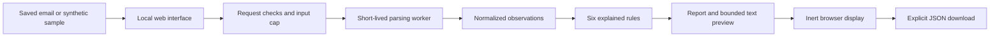

# Phishing Email Analyzer: evidence before a verdict

## Problem and outcome

Saved suspicious emails contain useful evidence, but viewing them directly can mix analysis with unsafe interaction. This project provides a small local workspace that extracts observations, explains six deterministic rules, and exports a structured triage report. It uses synthetic fixtures and does not connect to a mailbox.

The primary portfolio signal is SOC triage: distinguish observed facts from uncertainty and document a next action. The secondary signals are risk communication and application security: enforce upload limits, prevent active email rendering, and verify input protections with real tests.

## How it works

The Python parsing/report layer is independent of Flask. Email content crosses into the browser as data, never executable markup. Raw upload bytes travel through pipes; no email file is intentionally written by the server. A concern rating is produced only when inspection completes within the configured limits.

## Worked investigation: account notice

Input: `suspicious.eml`, a bundled synthetic account notice. Sender domain: `example.org`; Reply-To: `other.example`. The anchor displays `https://example.org/account` but points to `https://review.other.example/verify`.

| Observation | Rule | Triage contribution |
| --- | --- | --- |
| Different sender and reply domain | SENDER-01 | +1, contextual; legitimate services may use different reply domains |
| Displayed and actual link hosts differ | LINK-01 | +3, misleading destination evidence |
| Header claims authentication passes | Unverified observation | No score change; a saved header can be forged |

Result: four weighted points, High observed concern. This prioritizes review rather than proving malicious intent. Suggested next steps: avoid the destination, confirm the account notice through a known channel, preserve the report, and escalate under the organization's process if context warrants it.

The sample also contains a script and remote image. Browser tests verify that the script does not execute and the image is not requested. The UI displays destination text without creating an email-derived clickable link.

## Design decisions

- Local-only, deterministic rules make the evidence reproducible without API keys, reputation services, or personal mailbox access.
- Authentication claims remain separate from verified facts. They cannot raise or lower the rating.
- Score once per rule to prevent repeated copies of one link from inflating concern.
- Preserve evidence and suppress the overall rating when duplicate headers or conflicting markup make analysis incomplete.
- Use bounded worker execution for malformed input; clearly disclose that it is not an operating-system or hard memory sandbox.

The independent code review found duplicate `href` handling and duplicate MIME headers could produce misleading complete reports. Regression tests reproduced the problems before fixes: preserve the first `href`, flag ambiguity, and remove the overall score for partial analysis. Additional fixes covered empty `href` and defective sender-domain comparisons.

## Evidence and limitations

See [verification.md](../evidence/verification.md) for commands and observed results, [the synthetic JSON report](../evidence/sample-report.json), and [screenshots](../evidence/screenshots/desktop-report.png).

The four bundled fixtures have hand-written expected rule IDs and completeness labels. Additional unit and integration cases cover boundary conditions and hostile input. These samples validate behavior; they do not measure real-world phishing accuracy. A benign third-party Reply-To or internationalized domain can trigger a contextual finding. No configured indicators does not mean safe.

No DNS checks, DKIM verification, malware scanning, attachment execution, archive extraction, or live URL visits. Hosted deployment, mailbox integration, and external reputation are future design decisions, not completed features.

## Interview talking points

- **SOC/security analyst:** Walk through the account-notice evidence, uncertainty in authentication headers, and justified escalation without claiming a verdict.
- **Vulnerability management/technology risk:** Explain how parser ambiguity became a tracked risk, a reproduced failure, a fix, and retest evidence.
- **Application security:** Demonstrate hostile HTML/filename tests, local-request controls, worker lifecycle limits, and the distinction between safe display and detection accuracy.

## Two-minute demo

1. Start locally and choose the everyday sample: show zero configured findings and the safety disclaimer.
2. Analyze the account notice: expand evidence, compare the two domains, and explain the four-point rating.
3. Expand authentication observations: describe why claimed passes are unverified.
4. Download JSON, clear the report, then select the incomplete sample to show rating suppression.
5. Close with the browser security checks and the limits of the synthetic corpus.

## Resume wording after verification

Built a local Python/Flask phishing email triage tool with six explainable rules, bounded MIME parsing, protected uploads, and JSON reporting; verified behavior through automated analysis, API, and browser tests using synthetic email fixtures.

Use this wording only after reviewing and understanding the code and evidence. Add test counts from the final verification record rather than estimating them.
